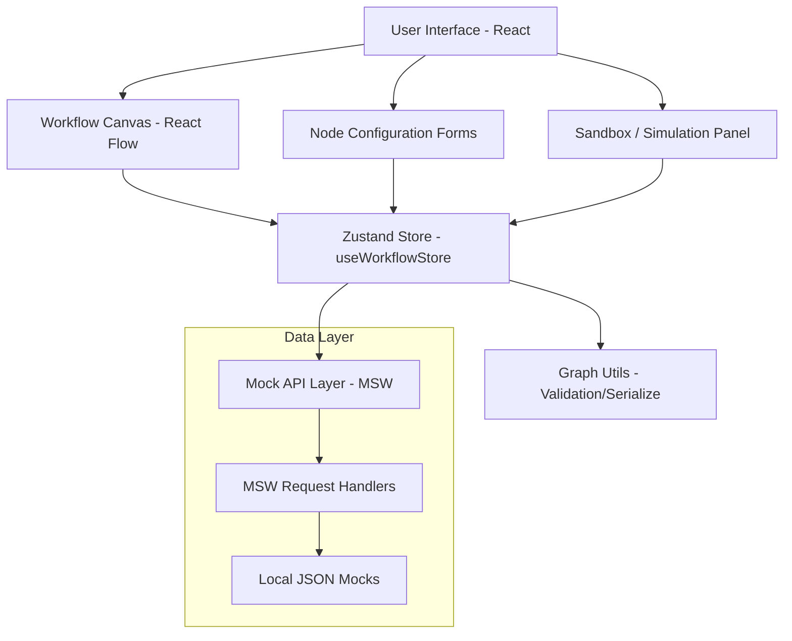

# HiCapy: HR Workflow Designer Module

A premium, modular HR Workflow Designer built with React, React Flow, and TypeScript. This application allows HR admins to visually design, configure, and simulate complex automation workflows such as onboarding, leave approvals, and more.

##  Key Features

- **Intuitive Canvas Interaction**: Drag-and-drop nodes, connect with 4-sided handles, and manage edges with visual deletion.
- **Rich Node Palette**: Specialized nodes for HR tasks, including Start, Task, Approval, Automated Steps, Conditions, Email, Timer, and Webhook.
- **Dynamic Configuration Forms**: Context-sensitive sidebar forms for each node type with full state synchronization.
- **Workflow Simulation**: A real-time sandbox panel that serializes the graph, validates structural constraints, and provides a step-by-step execution log via a mock API.
- **Modern Aesthetics**: Premium dark/light themes, smooth animations, and a high-fidelity 3D loading experience.
- **Power Features**: Undo/Redo history, Auto-layout, Mini-map, Zoom controls, and Export/Import as JSON.

##  System Architecture



### ASCII View
```text
 +---------------------------------------------------------+
 |                   User Interface (React)                |
 +------------+----------------+----------------+----------+
              |                |                |
      +-------v-------+  +-----v-----+  +-------v-------+
      | Canvas (Flow) |  | Config UI |  | Sandbox Panel |
      +-------+-------+  +-----+-----+  +-------+-------+
              |                |                |
              +----------------+----------------+
                               |
                   +-----------v-----------+
                   |  Zustand Global Store |
                   +-----------+-----------+
                               |
              +----------------+----------------+
              |                |                |
      +-------v-------+  +-----v-----+  +-------v-------+
      | Graph Utils   |  | API Client|  | MSW Mocks     |
      +---------------+  +-----------+  +---------------+
```

##  Project Structure

```text
src/
├── api/                  # API service layer & MSW mock definitions
│   ├── mocks/            # MSW Service Worker handlers & browser config
│   ├── automations.ts    # Service to fetch mock automated actions
│   └── simulate.ts       # Service to POST workflow for simulation
├── components/           # Modular React components
│   ├── canvas/           # React Flow implementation & Toolbar
│   ├── forms/            # Node-specific configuration forms
│   ├── nodes/            # Visual definitions for custom nodes
│   ├── panels/           # Contextual side panels (Insight/NodeForm)
│   ├── sandbox/          # Simulation UI & Execution logs
│   └── ui/               # Reusable atomic UI components (Buttons, Inputs)
├── hooks/                # Custom React hooks & Zustand store
├── types/                # TypeScript interfaces & Enums
├── utils/                # Graph processing & structural validation
├── App.tsx               # Main layout & Root application logic
└── main.tsx              # Application entry point & MSW initialization
```

##  Architecture & Design Choices

### 1. State Management
- **Zustand**: Used as the primary store (`useWorkflowStore.ts`) for managing node/edge state, history/undo-redo, and simulation progress. Zustand was chosen over Redux for its simplicity and better performance with React Flow's frequent updates.
- **React Flow**: Orchestrates the canvas logic. Custom node components (`BaseNode.tsx`) provide a unified design language while allowing type-specific decorators.

### 2. Component Decomposition
- **Separation of Concerns**: Architecture is split into **Canvas** (React Flow), **Forms** (Configuration UI), **Nodes** (Visual representation), and **API** (Mock data services).
- **Hooks-based Logic**: Complex logic for simulations (`useSimulate.ts`) and auto-layout (`autoLayout.ts`) is abstracted into hooks and utility functions to keep components clean.

### 3. API Layer
- **Mock Service Worker (MSW)**: Implements the mock API layer (`/api/automations`, `/api/simulate`). This allows the frontend to be developed against "real" network requests without needing a backend server, ensuring easy integration with a future production API.

### 4. Scalability & Modularity
- **Node-Type Mapping**: Form and Node registration use central maps (`nodeTypes`, `FORM_MAP`). Adding a new node type requires only creating the component and updating the map, making the system highly extensible.
- **CSS-Variables**: The entire design system is built on CSS variables (`index.css`), facilitating easy theme switching and brand customization.

##  Getting Started

### Prerequisites
- Node.js (v18+)

### Installation
```bash
npm install
```

### Development
```bash
npm run dev
```

### Production Build
```bash
npm run build
```

---

##  Requirements Satisfaction

- [x] **React + React Flow Prototype** (Built with Vite + TypeScript)
- [x] **Multiple Custom Nodes** (Start, Task, Approval, Auto, etc.)
- [x] **Configurable Forms** (Deep field support for each node type)
- [x] **Mock API Integration** (MSW handling GET/POST endpoints)
- [x] **Sandbox Panel** (Graph serialization & step-by-step execution)
- [x] **Clean Architecture** (Modular structure, reusable hooks, type safety)
- [x] **Bonus Items** (Undo/Redo, Export/Import, Auto-layout, Mini-map)
